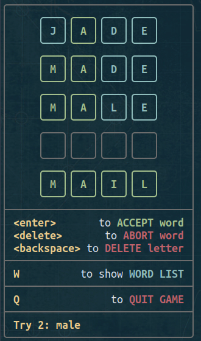
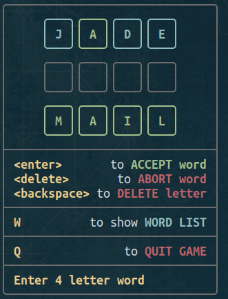
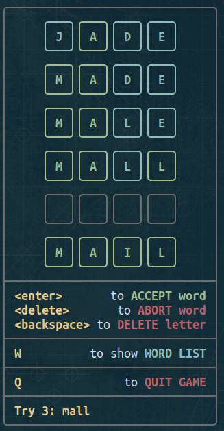
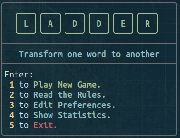

# Ladder

---

---
**Ladder** is a word  puzzle, played in a terminal window.

{width=200}


Your starting point is an **initial four-letter word**.

Your goal is to **transform  this word, one letter at a time**, through other valid words,
and end up with  the **target word.**

The tricky part is that on each entry, you can change **ONLY ONE LETTER**.


---

For instance, if the initial word is **JADE**, and the target word is **MAIL**, then you should go like this:

{width=150}
{width=150}
{width=150}
{width=150}
{width=150}
---


{width=200}


From the **Main Menu**, the user can either

- **Start a new game**

- **Read the puzzple rules**


{width=400}


or

- **See the statistics**

 {width=200}

---


## Dependencies

* As mentioned above, this script is using the word list contained in `/usr/share/dict/words`.

  If your distro doesn't include this installed, you can install the respective package (`wordlist`, `words`) using the respective command (`apt`, `pacman`).

* **ADDITIONALLY**, if someone wishes to play the game using a different word list, they can do so, editing **LINE 17**of the `ladder.sh`

```
WORD_LIST="/usr/share/dict/words"

```
change to
```
WORD_LIST="/path/to/prefered/wordlist"

```


* Another, much less important dependency is [lolcat](https://github.com/busyloop/lolcat).

 `lolcat` helps show the *Statistics* in **color**, and therefore more fun.


 To install `lolcat`

  * Debian based:

    ```
    sudo apt install lolcat
    ```

 * Arch based:

    ```
    sudo pacman -S lolcat
    ```

 * CentOS, RHEL, Fedora:

    ```
    sudo dnf install lolcat
    ```

---
## Install

Clone the repo, then change directory to `ladder`:
```
git clone https://gitlab.com/christosangel/ladder.git && cd ladder/
```

To run the script from any directory, it has to be made executable, and then copied to `$PATH`:

```
chmod +x ladder.sh && cp ladder.sh ~/.local/bin/
```

After that, the user must run this command in order to create the necessary directories and files:

```
mkdir ~/.cache/ladder/ && cp statistics.txt ladder.png ~/.cache/ladder/
```

---
## Run

Just run:

```
ladder.sh
```
This TUI game was partly inspired by [weaver](https://weavergame.org/)

If you like this project, there is a couple of other projects that might interest you:

[https://gitlab.com/christosangel/wordy](https://gitlab.com/christosangel/wordy)

[https://gitlab.com/christosangel/spelion](https://gitlab.com/christosangel/spelion)

***Have fun!***
